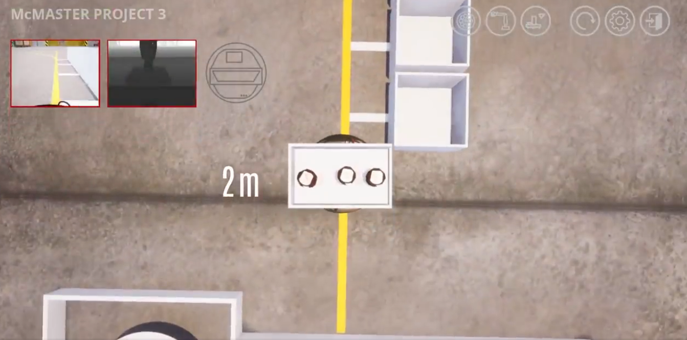
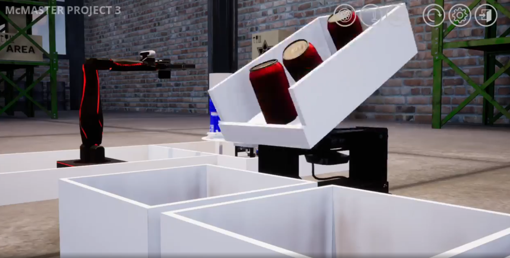

# Project 3 System for Sorting and Recycling Containers

## Table of contents

- [Overview](#overview)
  - [The challenge](#the-challenge)
  - [Screenshot](#screenshot)
- [My process](#my-process)
  - [Built with](#built-with)
  - [What I learned](#what-i-learned)

## Overview

### The challenge
- Develop a system that can efficiently sort recyclables and transfer them to corresponding bins. Using Python create a program that can control robotic devices by connecting to a raspberry py and using a remote environment (Quanser Labs).
- Use the Q-arm and the Q-bot to transfer the containers in their appropiate bins.

### Screenshot

## My process

### Built with

- Python: Functions, conditionals, and loops.
- Q-arm and Q-bot (ground robot) methods (common_libraries folder) used to move both robotic devices.
- Ultrasonic sensor modules (common_libraries folder) provided to track the final bin distance.

### What I learned

From this challenge I strengthened my knowledge of Python computation and scripting. Moreover, I learned more about python functions and also developed my abilities to resolve any bugs or issues within the program. 
